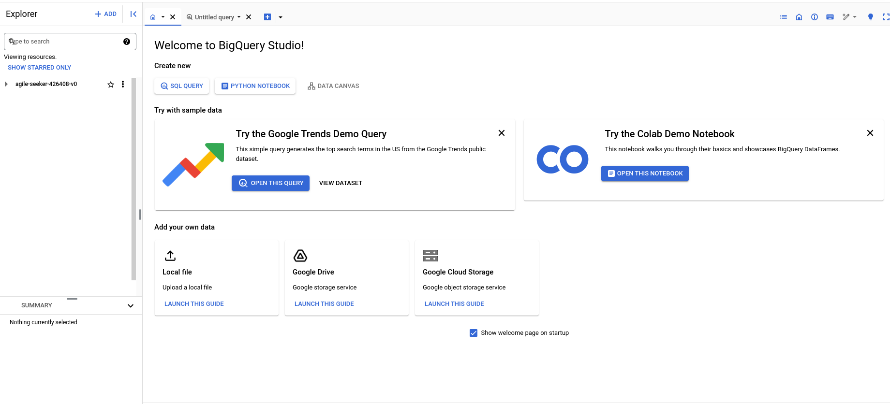
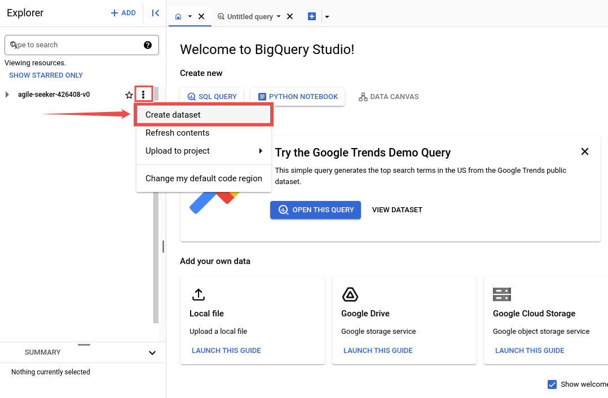

<h1 style="text-align: center;">Big Query</h1>

Adding and configuring BigQuery connection within Qualytics empowers the platform to build a symbolic link with your schema to perform operations like data discovery, visualization, reporting, cataloging, profiling, scanning, anomaly surveillance, and more.  

This documentation provides a step-by-step guide on adding BigQuery as both a source and enrichment datastore in Qualytics. It covers the entire process, from initial connection setup to testing and finalizing the configuration. 

By following these instructions, enterprises can ensure their BigQuery environment is properly connected with Qualytics, unlocking the platform's potential to help you proactively manage your full data quality lifecycle.

Let’s get started 🚀

##  BigQuery Setup Guide 

This guide explains how to create and use a temporary dataset with an expiration time in BigQuery. This dataset helps manage intermediate query results and temporary tables when using the Google BigQuery JDBC driver.

It is recommended for efficient data management, performance optimization, and automatic reduction of storage costs by deleting data when it is no longer needed.

### Access the BigQuery Console

**Step 1:** Navigate to the BigQuery console within your Google Cloud Platform (GCP) account.

**Step 2:** Click on the “vertical ellipsis”, it will open a popup menu for creating a dataset.
Click on the “Create dataset” to set up a new dataset.

**Step 3:** Fill details for the following fields to create a new dataset.

>**Info:**
>>⦁	Dataset Location: Select the location that aligns with where your other datasets reside to minimize data transfer delays.
>>⦁	Default Table Expiration: Set the expiration to 1 day to ensure any table created in this dataset is automatically deleted one day after its creation.

