<h1 style="text-align: center;">Big Query</h1>

Adding and configuring BigQuery connection within Qualytics empowers the platform to build a symbolic link with your schema to perform operations like data discovery, visualization, reporting, cataloging, profiling, scanning, anomaly surveillance, and more.  

This documentation provides a step-by-step guide on adding BigQuery as both a source and enrichment datastore in Qualytics. It covers the entire process, from initial connection setup to testing and finalizing the configuration. 

By following these instructions, enterprises can ensure their BigQuery environment is properly connected with Qualytics, unlocking the platform's potential to help you proactively manage your full data quality lifecycle.

Let’s get started 🚀

##  BigQuery Setup Guide 

This guide explains how to create and use a temporary dataset with an expiration time in BigQuery. This dataset helps manage intermediate query results and temporary tables when using the Google BigQuery JDBC driver.

It is recommended for efficient data management, performance optimization, and automatic reduction of storage costs by deleting data when it is no longer needed.

### Access the BigQuery Console

**Step 1:** Navigate to the BigQuery console within your Google Cloud Platform (GCP) account.


**Step 2:** Click on the “vertical ellipsis”, it will open a popup menu for creating a dataset.
Click on the “Create dataset” to set up a new dataset.


**Step 3:** Fill details for the following fields to create a new dataset.

>**Info:**
>>⦁	Dataset Location: Select the location that aligns with where your other datasets reside to minimize data transfer delays.
>>⦁	Default Table Expiration: Set the expiration to 1 day to ensure any table created in this dataset is automatically deleted one day after its creation.

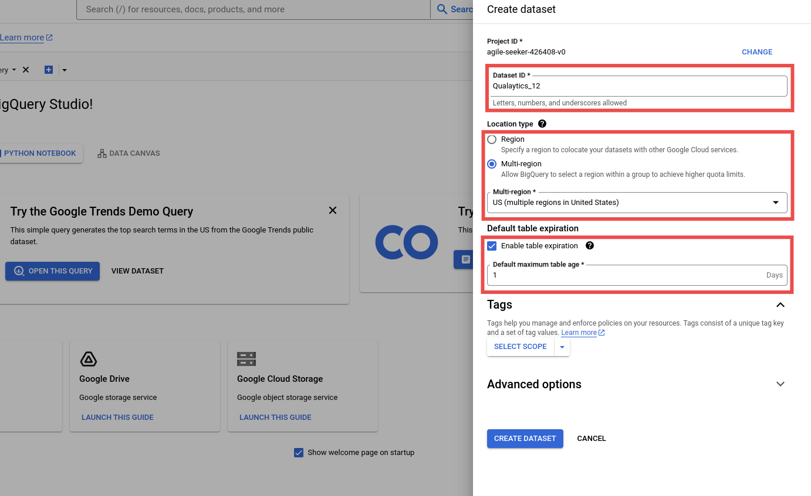

**Step 4:** Click the **"Create Dataset"** button to apply the configuration and create the dataset.

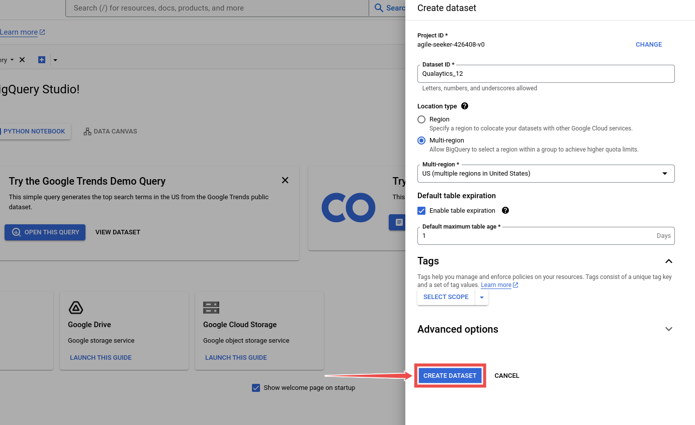

**Step 5:** Navigate to the **“created dataset”** and **find the Dataset ID** in the **Dataset Info**.

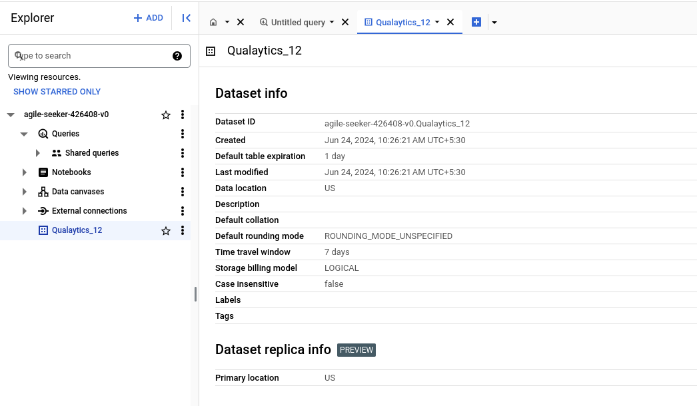

The dataset Info section contains the Dataset ID and other information related to the created
dataset. This generated Dataset ID is used to configure the BigQuery datastore.

## BigQuery Roles and Permissions

This section explains the roles required for viewing, editing, and running jobs in BigQuery. To
integrate BigQuery with Qualytics, you need specific roles and permissions.

Assigning these roles ensures Qualytics can perform data discovery, management, and
analytics tasks efficiently while maintaining security and access control.

## BigQuery Roles

- BigQuery Data Editor ```(roles/bigquery.dataEditor)```
Allows modification of data within BigQuery, including adding new tables and changing
table schemas. It is suitable if you want to regularly update or insert data.
- BigQuery Data Viewer ```(roles/bigquery.dataViewer)```
Enables viewing datasets, tables, and the contents. It is essential if you need to read
data structures and information.
- BigQuery Job User ```(roles/bigquery.jobUser)```
Allows creating and managing jobs in BigQuery, such as queries, data imports, and data
exports. It is important if you want to run automated queries.
- BigQuery Read Session User ```(roles/bigquery.readSessionUser)```
Allows usage of the BigQuery Storage API for efficient retrieval of large data volumes. It
provides capabilities to create and manage read sessions, facilitating large-scale data
transfers.

## Datastore BigQuery Privileges

The following table outlines the privileges associated with BigQuery roles when configuring
datastore connections in Qualytics:

## Source Datastore Permissions (Read-Only)

Provides read access to view table data and metadata.


|REF| READ-ONLY PERMISSIONS| DESCRIPTION|
|---|----------------------|------------|
|1. |roles/bigquery.dataViewer| Allows viewing of datasets, tables, and their data.|
|2. |roles/bigquery.jobUser| Enables running of jobs such as queries and data loading.|
|3. | roles/bigquery.readSessionUser| Facilitates the creation of read sessions for efficient data retrieval|

## Enrichment Datastore Permissions (Read-Write)

Grants read and write access for data editing and management.

|REF| WRITE-ONLY PERMISSIONS| DESCRIPTION|
|---|-----------------------|------------|
|4. |roles/bigquery.dataEditor |Provides editing permissions for table data and schemas.|
|5. |roles/bigquery.dataViewer |Allows viewing of datasets, tables, and their data.|
|6. |roles/bigquery.jobUser |Enables running of jobs such as queries and data loading.|
|7. |roles/bigquery.readSessionUser |Facilitates the creation of read sessions for efficient data retrieval.|

# Add a Source Datastore

A source datastore is a storage location used to connect to and access data from external
sources. BigQuery is an example of a source datastore, specifically a type of JDBC datastore
that supports connectivity through the JDBC API. Configuring the JDBC datastore enables the
Qualytics platform to access and perform operations on the data, thereby generating valuable
insights.

**Step 1:** Log in to your Qualytics account and click on the “Add Source Datastore” button
located at the top-right corner of the interface.

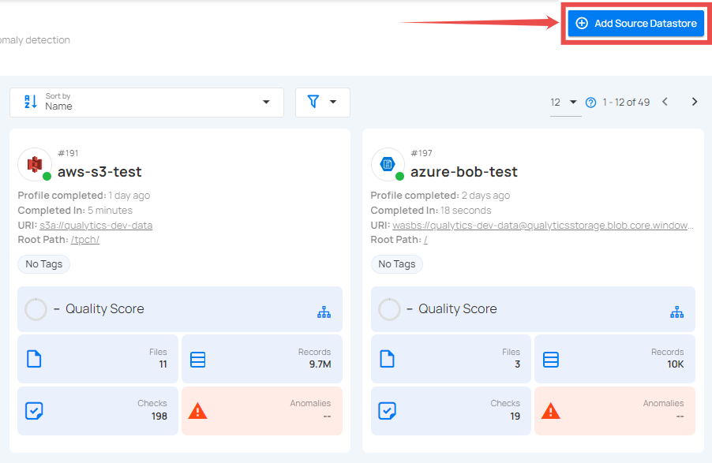

**Step 2:** A model window- "Add Dstastore" will appear, providing you with the option to connect a datastore.

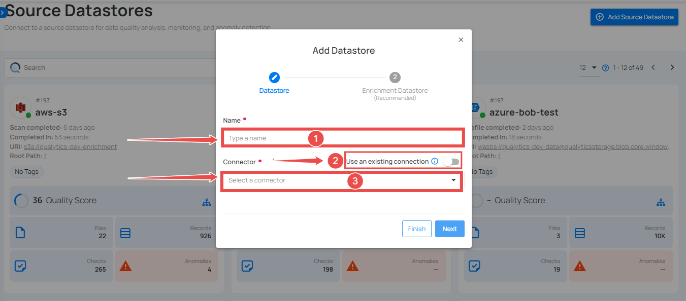

| REF. | FIELDS | ACTIONS |
|------|--------|---------|
| 1️. | Name(Required) | Specify the name of the datastore (e.g. The specified name will appear on the datastore cards.)|
| 2️. |Toggle Button |Toggle ON to reuse credentials from an existing connection, or toggle OFF to create a new source datastore from scratch.|
| 3. |Connector(Required)| Select “BigQuery” from the dropdown list.|

# Option I: Create a Source Datastore with a new Connection

If the toggle for **“Use an existing connection”** is turned off, then this will prompt you to add
and configure the source datastore from scratch without using existing connection details.

**Step 1:** Select the **“BigQuery”** connector from the dropdown list and add connection details
such as temp dataset ID, service account key, project ID, and dataset ID.

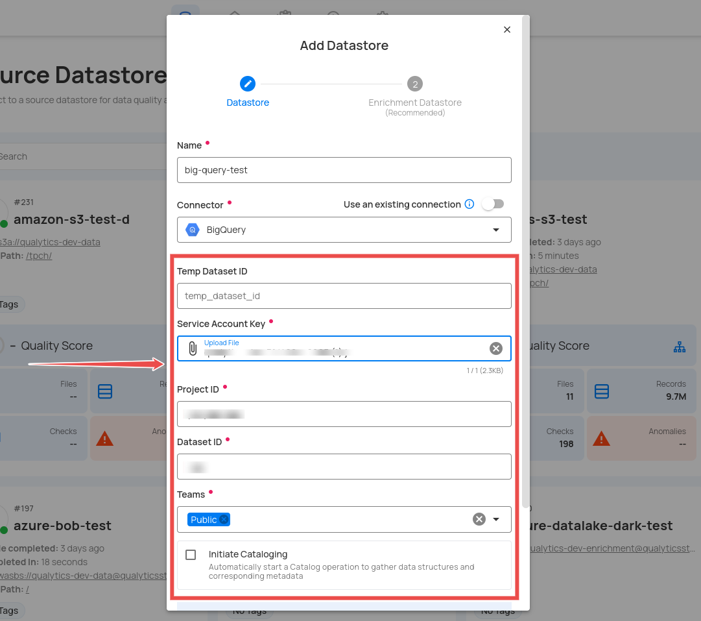

**Step 2:** The configuration form will expand, requesting credential detail before establising the connection.

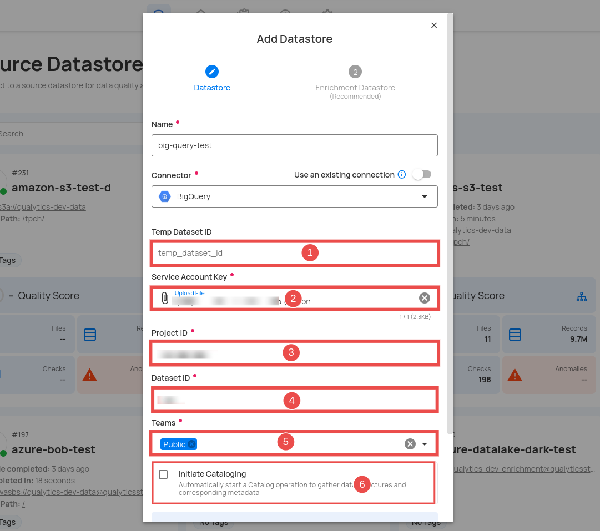

| REF. | FIELDS | ACTIONS |
|------|--------|---------|
| 1. |Temp Dataset ID(Optional)| Enter a temporary Dataset ID for intermediate data storage during BigQuery operations.|
| 2. |Service Account (Required)| Upload a JSON file that contains the credentials required for accessing BigQuery.|
| 3. | Project ID (Required)| Enter the Project ID associated with the BigQuery.|
| 4. |Dataset ID(Required)| Enter the Dataset ID (schema name) associated with the BigQuery.|
| 5. |Teams(Required)| Select one or more teams from the dropdown to associate with this source datastore.|
| 6. |Initial Cataloging(Optional)| Tick the checkbox to automatically perform catalog operation on the configured source datastore to gather data structures and corresponding metadata.|

**Step 3:** After adding the source datastore details, click on the “Test Connection” button to check and verify its connection.

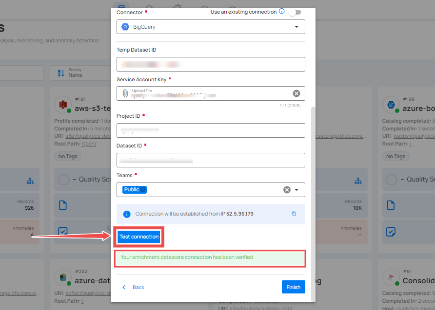

If the credentials and provided details are verified, a success message will be displayed
indicating that the connection has been verified.

## Option II: Use an Existing Connection

If the toggle for **“Use an existing connection”** is turned on, then this will prompt you to
configure the source datastore using the existing connection details.

**Step 1:** Select a **"connection"** to reuse existing credentials.

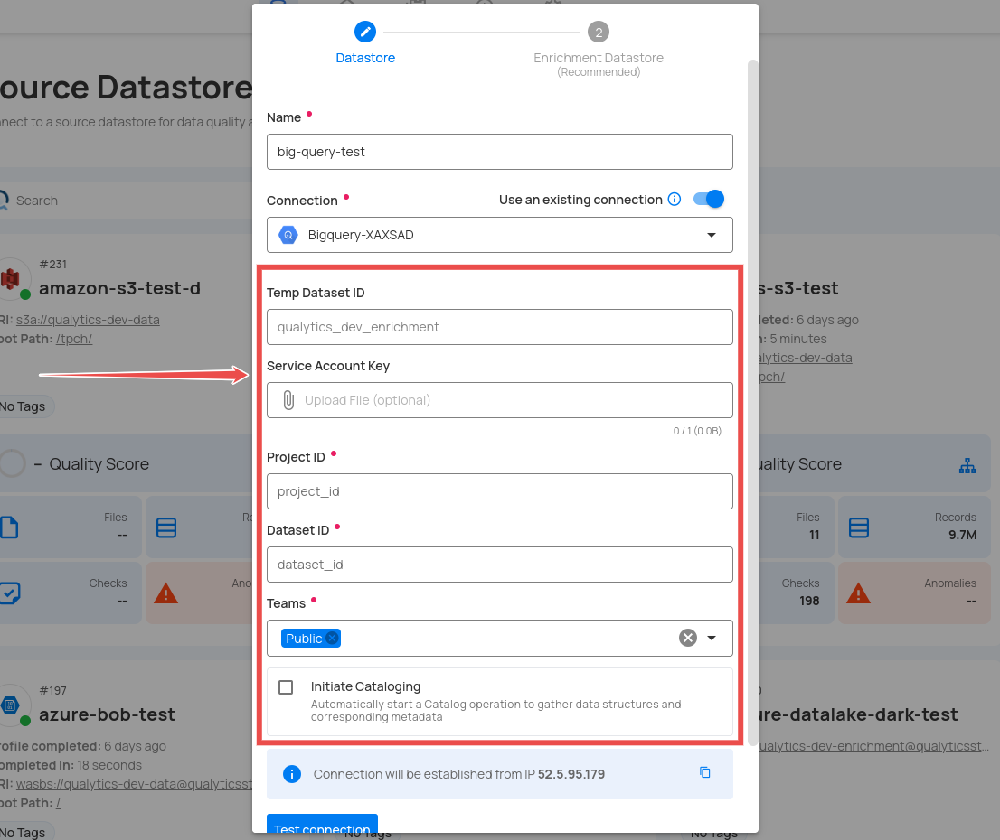

**Note:** If you are using existing credentials, you can only edit the details such as **Project ID, Dataset ID, Teams,** and **Initiate Cataloging.**

**Step 2:** Click on the **“Test Connection”** button to verify the existing connection details. If connection details are verified, a success message will be displayed.

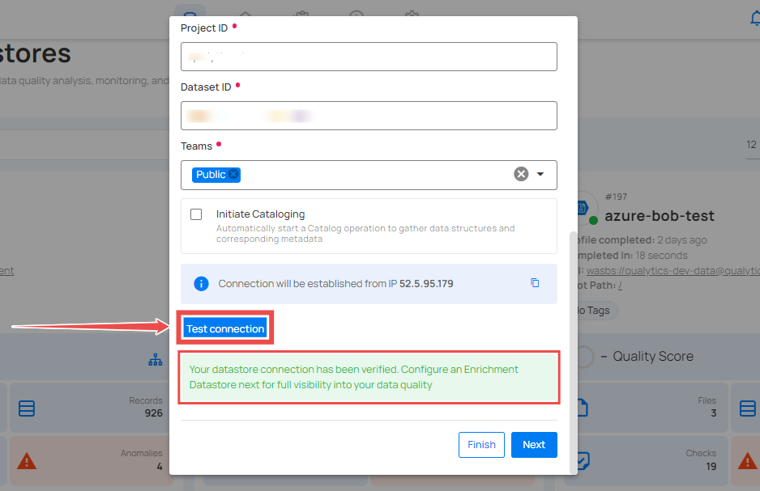

**NOTE:** Clicking on the **"Finish"** button will create the source datastore and bypass the **"enrichment datastore"** configuration step.

**TIP:** It is recommended to click on the **"Next"** button, which will take you to the **"enrichment datastore"** configuration page.

## Add Enrichment Datastore

Once you have successfully tested and verified your source datastore connection, you have the
option to add the enrichment datastore **(recommended)**. The enrichment datastore is used to
store the analyzed results, including any anomalies and additional metadata in tables. This
setup provides full visibility into your data quality, helping you manage and improve it effectively.

**Step 1:** Whether you have added a source datastore by creating a new datastore connection or
using an existing connection, click on the **“Next”** button to start adding the **“Enrichment Datastore”**

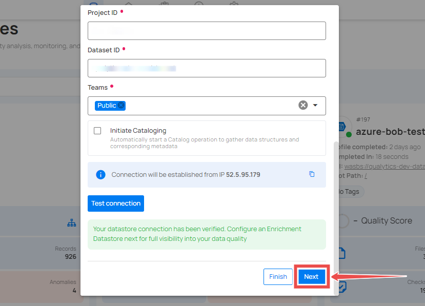

**Step 2:** A modal window- **“Add Enrichment Datastore”** will appear, providing you with the
options to configure to add an “enrichment datastore”.